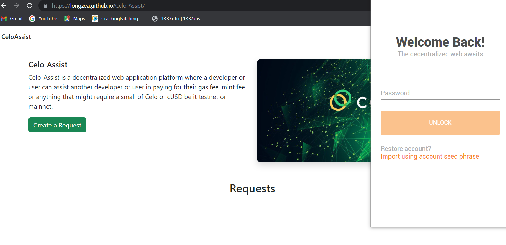

# How to Build a Celo Assistance dApp

## Table of Content
- [Introduction](#introduction)
  - [What is Celo](#what-is-celo)
- [Prerequisites](#prerequisites)
- [Requirements](#requirements)
- [Developing Our Smart Contract](#developing-our-smart-contract)
- [Deploying our smart contract](#deploying-our-smart-contract)
- [Developing the frontend](#developing-the-frontend)
- [The HTML Part of the dAPP](#the-html-part-of-the-dapp)
- [The Javascript part of the DApp](#the-javascript-part-of-the-dapp)
  - [The index.js file](#the-indexjs-file)
  - [The App.js file](#the-appjs-file)
  - [The Header.js component](#the-headerjs-component)
  - [The RequestList.js file](#the-requestlistjs-file)
- [Conclusion](#conclusion)
- [Next Steps](#next-steps)
- [About the Author](#about-the-author)

## Introduction:

Before we proceed here is a preview and a live demo link of what will be building:

[Demo](https://longzea.github.io/Celo-Assist/)

Below is a preview of what we are going to build.




### What is Celo?

Celo is a blockchain protocol that aims to address some of the barriers to cryptoasset adoption (user experience and volatility) by using phone numbers as public keys and issuing a native stable-value token. The network supports the development of smart contracts and decentralized applications.


## Prerequisites:

- Basic understanding of blockchain concepts. You can click [here](https://dacade.org/communities/blockchain/courses/intro-to-blockchain) to learn.
- Basic understanding of what a smart contract is.
- Basic knowledge on Solidity and its concepts. you can click [here](https://dacade.org/communities/ethereum/courses/sol-101/learning-modules/dcc5e8e2-bc22-49a6-ace7-23ec7fcc81d5) to learn
- Basic knowledge of React.js
- Basic understanding of how git and github works.

## Requirements: 

- Access to a computer with an internet connection and a chrome web browser.
- **[NodeJS](https://nodejs.org/en/download)** from V12.or higher
- A code editor or text editor. **[VSCode](https://code.visualstudio.com/download)** is recommended
- A terminal. **[Git Bash](https://git-scm.com/downloads)** is recommended
- Remix IDE. Click **[here](https://remix.ethereum.org)** for the web version.
- Celo Extension Wallet. Click **[here](https://chrome.google.com/webstore/detail/celoextensionwallet/kkilomkmpmkbdnfelcpgckmpcaemjcdh?hl=en)** to download.
- A Github account.

 Lets us Begin

## Developing Our Smart Contract:

In developing our smart contract we are going to use Remix which is a web-based IDE for writing smart contracts in Solidity.

To get started, open the Remix IDE by clicking on the link https://remix.ethereum.org/ you will see a contract folder. Inside that contract folder, create a Solidity file called `CeloAssist.sol`. The `.sol` extension indicates that it is a Solidity file. 

Next inside the file, let's create a license identifier that helps in governing our code and it should be used to avoid any legal issues.


```solidity
// SPDX-License-Identifier: MIT
pragma solidity >=0.7.0 <0.9.0;
```

In the above code, we use `MIT` as our license identifier, and the pragma keyword is used to specify the Solidity version that we want the compiler to use. In this case, it should be higher than or equal to seven and lower than nine. 

Up next, we are going to define an `IERC20Token` interface which enables us to interact with the Celo USD stablecoin (cUSD). 

```solidity
interface IERC20Token {
  function transfer(address, uint256) external returns (bool);
  function approve(address, uint256) external returns (bool);
  function transferFrom(address, address, uint256) external returns (bool);
  function totalSupply() external view returns (uint256);
  function balanceOf(address) external view returns (uint256);
  function allowance(address, address) external view returns (uint256);

  event Transfer(address indexed from, address indexed to, uint256 value);
  event Approval(address indexed owner, address indexed spender, uint256 value);
}
```

Most tokens are ancestors of the very popular ERC-20 token and follow its standard interface. It provides you with very practical basic functionality that you don’t have to implement yourself

You create an interface using the interface keyword, followed by a name. You can choose IERC20Token or another name, and the functionality of the interface. In this case, the functionality of the ERC-20 token.

Next, let's define our contract by using the `contract` keyword followed by the name of the contract and then an open and close curly braces. Inside the curly braces is where we will be declaring our variables and function.


```solidity
contract CeloAssist{
    // Declaring variables.
    uint internal payeeLength = 0;
    address internal cUsdTokenAddress = 0x874069Fa1Eb16D44d622F2e0Ca25eeA172369bC1;
```

In the above code, we create our contract with the name `CeloAssist`, followed by two variables `payeeLength` and `cUsdTokenAddress`. The `payeeLength` keeps track of the number of users that has create a request while the `cUsdTokenAddress` store the `address` of the cUSD `ERC-20` token in order to interact with it.

Next,  we are going to create a constructor for the cUSD address incase the address changes in the future we won't find it difficult to change it.

```solidity
// Creating a constructor for the cUSD address
    constructor(address _cUsdTokenAddress) {
    cUsdTokenAddress = _cUsdTokenAddress;
    }
```

In next we are going to create two `structs`. Structs are a collection of variables that can consist of different data types. You can learn more about struct ([here](https://docs.soliditylang.org/en/latest/types.html#structs))

```solidity

// Struct to create payee details.
    struct PayeeDetails {
        address payable  owner;
        string payeeFullName;
        string payeeDescription;
        string networkType;
        uint payeeGasFee;   
    }

    // Struct to create chats
    struct Chat{
        address owner;
        string  message;
    }

``` 

The first struct is used to create the details of a payee, and those details consist of:
 1. `owner` : this stores the payee's address, which is `payable` and it's datatype is `address`.
 2. `payeeFullName` : this stores the fullname of the payee and it's  datatype is `string`. 
 3. `payeeDescription` : this stores the payee's description on what he / she wants and it's of datatype `string`
 4. `networkType` : this stores the network type in which the amount should be paid in and it's of datatype `string`
 5. `payeeGasFee` : this stores the amount requested by the user and it's to datatype `uint`.

 The second struct is used to create the chat details and it consist of 
  1. `owner` : this stores the address of the sender  and it's datatype is `address`.
  2. `message` : this stores the chat message and it's datatype is `string`.

  Up next, we are going to create two `mappings` to store store payee request and also store chats associated with a payee. A `mapping` is like a collection of key types and corresponding value type pairs. You can learn more about `mapping` ([here](https://remix.ethereum.org/?#activate=solidityUnitTesting,solidity,LearnEth&call=LearnEth//startTutorial//ethereum/remix-workshops//master//soliditybeginner&lang=en&optimize=false&runs=200&evmVersion=null&version=soljson-v0.8.18+commit.87f61d96.js))

  ```solidity
    // mapping to store payee details
    mapping (uint => PayeeDetails) internal payee;

    // mapping to store chats
    mapping(uint => Chat[]) internal chats;
  ```

  The first `mapping` keeps track of payee's requests and has it's visibility set to `internal` since we only need it inside the function.

  While the second `mapping` also has it's visibility set to `internal` and it stores chat messages that is attached to a payee request.


  Up next,  we are going to create function called `createPayee` which will be used to create a payee request.

  ```solidity
    // Function to create a payee.
    function createPayee(string memory _payeeFullName, string memory _payeeDescription, string memory _networkType, uint _payeeGasFee   ) public {
        require(bytes(_payeeFullName).length > 0, "field cannot be empty"); 
        require(bytes(_payeeDescription).length > 0, "field cannot be empty");
        require(_payeeGasFee > 0, "fee be greater than 0");
       
        payee[payeeLength] = PayeeDetails({owner : payable(msg.sender), payeeFullName : _payeeFullName,
        payeeDescription : _payeeDescription, networkType : _networkType,
        payeeGasFee :  _payeeGasFee   });
        payeeLength++;
        emit PayeeCreated(payeeLength, msg.sender, _payeeFullName, _payeeDescription, _networkType, _payeeGasFee);
    }
  ```

The function above takes four parameters with their datatypes, then it uses the `require` method to ensure that those parameters should not be empty when a user fills out the form which we are going to create on the front end.

Furthermore, we assign the current payee request to our payee mapping, then we assign the corresponding parameters to the struct value which we created above and then increment the payeeLength by one.

Up next, we are going to create a function called `fetchPayeeById`. This function should be able to return the details of a payee by passing the id of that payee as a parameter.


```solidity
// Function to get a payee details through its id.
    function fetchPayeeById(uint _id) public view returns (
        address,
        string memory,
        string memory,
        string memory,
        uint
        
    ) {
        return (
            payee[_id].owner,
            payee[_id].payeeFullName, 
            payee[_id].payeeDescription,
            payee[_id].networkType,
            payee[_id].payeeGasFee
        );
    }
``` 

In the function above, the visibility is set to `public` and we use the `view` and `returns` keywords because we are not modifying anything, rather we fetching the details of that payee using an id.

The function returns the  `owner`, `payeeFullName`,  `payeeDescription`, `networkType` and the `payeeGasFee`.

Up next, we are going to create a function that can delete a payee request through it's id.

```solidity
 function deletePayeeRequest(uint id) public {
        require(msg.sender == payee[id].owner, "Please ensure you are the owner this request");
         
         // Shift remaining payees down in the mapping
        for (uint i = id; i < payeeLength - 1; i++) {
            payee[i] = payee[i+1];
        }

        // Delete the last element in the mapping
        delete payee[payeeLength - 1];
        payeeLength--;

        emit PayeeRequestDeleted(id, msg.sender);

    }
```

The function above takes one parameter `id` and its visibility is set to `public`. In the function we use the `require` method to ensure that the user deleting the request is also the owner of that request, otherwise, it will throw an error message "Please ensure you are the owner of this request".

NB: When you delete a payee which is a struct,  all its members are set to their default values. This means that the deleted payee is not removed from the mapping, but rather replaced with a default struct.

To delete the payee completely, we need to shift the remaining payees down in the mapping to fill the gap. This shifts the payees from id+1 to payeeLength-1 down by one position in the mapping and then deletes the last element in the mapping.

Up next, we are going to create a function called `fundPayee` which will be used to fund a payee's request.


```solidity
   // function to fund a payee 
    function fundPayee(uint _index) public payable  {
        require(
           IERC20Token(cUsdTokenAddress).transferFrom(
            msg.sender,
            payee[_index].owner,
            payee[_index].payeeGasFee
          ),
          "Transfer failed."
        );
        emit PayeeFunded(_index, msg.sender, payee[_index].payeeGasFee);
    }
```

The function above takes a parameter `_index` which will serve as the id of the payee and it's visiblility is set to public with the keyword `payable` because we will be sending tokens using the function.

In the function, the `require` method ensures that the cUSD transaction is successful. It then uses the ERC-20 token interface and the stored address to call the transferFrom method to transfer cUSD.

The first parameter is the address of the sender, accessed using the msg.sender method, the second parameter is the recipient of the transaction, which is the owner of the request at the given index, and the final parameter is the payeeGasFee which can also be the amount the payee needs.

Up next, we are going to create a function to store chat associated with a payee's request.

```solidity
    // Function to store chat messages
    function storeChatMessages(uint256 id, string memory _message) public {
         chats[id].push(Chat({owner : msg.sender, message : _message }));
    
    }
```

The function takes two parameters `id` and `_message` and its visibility is set to public. 
In the function, we assign the parameters to the Chat struct and then push the struct to chats mapping with its id to store the chats. 


Up next, we are going to create a function called `getChatById`. This function will help us get all chats associated with a request id.


```solidity
// Function to store chat messages
    function storeChatMessages(uint256 id, string memory _message) public {
         chats[id].push(Chat({owner : msg.sender, message : _message }));
         emit ChatMessageStored(id, msg.sender, _message);
    
    }
```

In the function above, it takes a parameter `id` and its visibility is set to public with the `view` and `returns` keywords. It returns an array of the Chat's struct associated with the payee id.

Up next, we are going to create a function called `getPayeeLength`. This will get the length of all payee's request.


```solidity
// function to get the number of payee.
    function getPayeeLength() public view returns (uint) {
        return (payeeLength);
    }    

}
```  
The function above returns the length of the payee.

Here is the full code:

```solidity
// SPDX-License-Identifier: MIT
pragma solidity ^0.8.3;

interface IERC20Token {
  function transfer(address, uint256) external returns (bool);
  function approve(address, uint256) external returns (bool);
  function transferFrom(address, address, uint256) external returns (bool);
  function totalSupply() external view returns (uint256);
  function balanceOf(address) external view returns (uint256);
  function allowance(address, address) external view returns (uint256);
  event Transfer(address indexed from, address indexed to, uint256 value);
  event Approval(address indexed owner, address indexed spender, uint256 value);
}

contract CeloAssist{
    // Declaring variables.
    uint internal payeeLength = 0;
    address internal cUsdTokenAddress = 0x874069Fa1Eb16D44d622F2e0Ca25eeA172369bC1;
     
    // Creating a constructor for the cUSD address
    constructor(address _cUsdTokenAddress) {
    cUsdTokenAddress = _cUsdTokenAddress;
    }
    
    // Struct to create payee details.
    struct PayeeDetails {
        address payable  owner;
        string payeeFullName;
        string payeeDescription;
        string networkType;
        uint payeeGasFee;   
    }

    // Struct to create chats
    struct Chat{
        address owner;
        string  message;
    }

    // Event emitted when a payee is created.
    event PayeeCreated(
        uint indexed payeeId,
        address indexed owner,
        string payeeFullName,
        string payeeDescription,
        string networkType,
        uint payeeGasFee
    );

    // Event emitted when a payee request is deleted.
    event PayeeRequestDeleted(
        uint indexed payeeId,
        address indexed owner
    );

    // Event emitted when a payee is funded.
    event PayeeFunded(
        uint indexed payeeId,
        address indexed funder,
        uint amount
    );

    // Event emitted when a chat message is stored.
    event ChatMessageStored(
        uint indexed payeeId,
        address indexed sender,
        string message
    );


    // mapping to store payee details
    mapping (uint => PayeeDetails) internal payee;

    // mapping to store chats
    mapping(uint => Chat[]) internal chats;


    // Function to create a payee.
    function createPayee(string memory _payeeFullName, string memory _payeeDescription, string memory _networkType, uint _payeeGasFee   ) public {
        require(bytes(_payeeFullName).length > 0, "field cannot be empty"); 
        require(bytes(_payeeDescription).length > 0, "field cannot be empty");
        require(_payeeGasFee > 0, "fee be greater than 0");
       
        payee[payeeLength] = PayeeDetails({owner : payable(msg.sender), payeeFullName : _payeeFullName,
        payeeDescription : _payeeDescription, networkType : _networkType,
        payeeGasFee :  _payeeGasFee   });
        payeeLength++;
        emit PayeeCreated(payeeLength, msg.sender, _payeeFullName, _payeeDescription, _networkType, _payeeGasFee);
    }


    // Function to get a payee details through its id.
    function fetchPayeeById(uint _id) public view returns (
        address,
        string memory,
        string memory,
        string memory,
        uint
        
    ) {
        return (
            payee[_id].owner,
            payee[_id].payeeFullName, 
            payee[_id].payeeDescription,
            payee[_id].networkType,
            payee[_id].payeeGasFee
        );
    }

    // function for a payee to delete his / her request 
    function deletePayeeRequest(uint id) public {
        require(msg.sender == payee[id].owner, "Please ensure you are the owner this request");
         
         // Shift remaining payees down in the mapping
        for (uint i = id; i < payeeLength - 1; i++) {
            payee[i] = payee[i+1];
        }

        // Delete the last element in the mapping
        delete payee[payeeLength - 1];
        payeeLength--;

        emit PayeeRequestDeleted(id, msg.sender);

    }

    // function to fund a payee 
    function fundPayee(uint _index) public payable  {
        require(
           IERC20Token(cUsdTokenAddress).transferFrom(
            msg.sender,
            payee[_index].owner,
            payee[_index].payeeGasFee
          ),
          "Transfer failed."
        );
        emit PayeeFunded(_index, msg.sender, payee[_index].payeeGasFee);
    }


    // Function to store chat messages
    function storeChatMessages(uint256 id, string memory _message) public {
         chats[id].push(Chat({owner : msg.sender, message : _message }));
         emit ChatMessageStored(id, msg.sender, _message);
    
    }

    //function to get chats associate with a payee by id
    function getChatsById(uint256 id) public view returns (Chat[] memory) {
        return chats[id];
    }


    // function to get the number of payee.
    function getPayeeLength() public view returns (uint) {
        return (payeeLength);
    }    

}
```
## Deploying our smart contract:

To deploy the smart contract, we would need to take the following steps:

1. Compile the code

2. Install the [CeloExtensionWallet](https://chrome.google.com/webstore/detail/celoextensionwallet/kkilomkmpmkbdnfelcpgckmpcaemjcdh?hl=en) from the Google Chrome store.


3. Create a wallet and ensure you store your key phrase in a very safe place when creating your wallet to avoid permanently losing your funds. 


4. Get the Celo token for the Alfajores testnet [here](https://celo.org/developers/faucet) : below is a break down of how to do it.


5. Install the Celo plugin on your Remix IDE by clicking on the Plugin manager, activate Celo, then you click on the Celo Icon.

6. On the sidebar, click on the connect button. Your Celo wallet should pop up asking for your approval. 

7. After connecting your wallet, click on the deploy button to deploy the contract. Ensure you take note of the deploy address because we will need it later. 


Congrats! you have just deployed your first smart contract on the Celo blockchain.

## Developing the frontend:

Going further we will be using a boilerplate from dacade in building the front end to interact with our smart contract that is being deployed on the Celo blockchain by following the steps below: 

1. Open a command line interface in the folder or directory where you want to build the front end and run the code below:

```bash
git clone https://github.com/Longzea/CeloAssist-Boilerplate
```

This will create a folder called `CeloAssist-Boilerplate`. The folder contains the neccessary setup files and folders needed to build our front end and connect it with our smart contract. The three main folders you should watch out for is the: 
- The `abis` folder which contains:
  - celoassist.abi.json file
  - celoassist.sol file
  - irc.abi.json file

The `components` folder which contains the `Header.js` file and the `RequestList.js` file. 

The `image` folder which contains the image we will use for the project.


2. Move to the root directory of the cloned repository on the same command line interface by running the code below:

```bash
cd CeloAssist-Boilerplate
``` 

The code changes the directory in the command line interface to the root directory for us to install the dependencies that comes with the boilerplate.

3. install all the dependencies by running the code below:

```bash
npm install
```

Installing all dependencies might take a while. After the dependencies have been installed. 

4. Start up the server by running the code:

```bash
npm start
```

Your project should be running here **http://localhost:3000/** and a browser window should pop up showing "hello world".

After starting the server we need to open the `CeloAssist-Boilerplate` folder which is the root folder in our IDE, in our case, the VSCode IDE.


## The HTML Part of the dAPP

Although in React you can embed HTML and Javascript together, there is a central place in which all HTMLs are connected. Open the public folder in the root directory and click on the index.html file. Inside the HTML file is where you can declare your HTML version, meta tags, and so on.

The first line of the HTML code is to declare our HTML version. In this tutorial, we shall be using html5.


```html
<!DOCTYPE html>
<html lang="en">

</html>
```

In the code above, we declare our HTML version which is version 5 and we tell declared the language version we want by using the opening html tag.

Up next, we are going to create our head element embedded inside the html tags. In the head, element is where we are going to declare our meta tags, title, and link our logo that will display on the browser tab.


```html
<head>
  <meta charset="UTF-8">
  <meta name="viewport" content="width=device-width, initial-scale=1.0">
  <meta http-equiv="X-UA-Compatible" content="ie=edge">
  <title>CeloAssist</title>
  <!-- site favicon -->
  <link rel="shortcut icon" type="image/png" href="%PUBLIC_URL%/assets2/image/celo-1.jpg"/>
</head>
``` 

Up next, we are going to create a body tag with some `divs` that will link to our main index.js file.

```html
<body>
  <!-- preloader start -->
  <div id="preloader"></div>
  <!-- preloader end -->   
      <noscript>You need to enable JavaScript to run this app.</noscript>
      <div id="root"></div>
  </body>
```

The id `root` connects the HTML file with our Javascript code.

Here is the full code:

```html
<!DOCTYPE html>
<html lang="en">

<head>
  <meta charset="UTF-8">
  <meta name="viewport" content="width=device-width, initial-scale=1.0">
  <meta http-equiv="X-UA-Compatible" content="ie=edge">
  <title>CeloAssist</title>
  <!-- site favicon -->
  <link rel="shortcut icon" type="image/png" href="%PUBLIC_URL%/assets2/image/celo-1.jpg"/>
</head>
<body>

  <!-- preloader start -->
  <div id="preloader"></div>
  <!-- preloader end -->   

      <noscript>You need to enable JavaScript to run this app.</noscript>
      <div id="root"></div>
      <!--
      This HTML file is a template.
      If you open it directly in the browser, you will see an empty page.

      You can add webfonts, meta tags, or analytics to this file.
      The build step will place the bundled scripts into the <body> tag.

      To begin the development, run `npm start` or `yarn start`.
      To create a production bundle, use `npm run build` or `yarn build`.
    --></div>

  </body>
  
  </html>
```

# The Javascript part of the DApp

## The index.js file

The index.js file is where we mount or render our main React component into the `root` id which is in our `index.html` file and we can also import the component which we want to use globally into the `index.html` file.

```js
import React from 'react';
import ReactDOM from 'react-dom';
import 'bootstrap/dist/css/bootstrap.min.css';
import App from './App';


ReactDOM.render(
  <React.StrictMode>
    <App />
  </React.StrictMode>,
  document.getElementById('root')
);
```

In the code above, we imported some libraries such as React and ReactDom which are useful in building our app. We also imported the bootstrap library because we are going to use some Reactstrap components in building our UI, we import the `App.js` component which is the root source in which other components are also rendered. 

Furthermore, we wrap the `App.js` component with the `ReactDOM.render` and target the root id in our `index.html` file.


## The App.js file

The App.js file can be located in the root folder which contains components to be rendered on the web page. It is the root source in which other components are also rendered. 

Next, we are going to import some of the libraries we need.


```js
import React, { useState, useEffect } from 'react';
import Web3 from 'web3'
import { newKitFromWeb3 } from '@celo/contractkit';
import BigNumber from "bignumber.js";
```

We are going to start by importing standard react hooks like `useState` and `useEffect` from the react library.

Then we import the web3, contractkit, and bignumber js objects from their libraries.

Celo's operations often deal with numbers that are too large for Javascript to handle. To handle these numbers, we will use bignumber.js.

Next, we are going to import our abi's which are the `celoassist` and `erc20` abi from the `abis` folder.


```js
import celoassist from './abis/celoassist.abi.json';
import erc20 from './abis/irc.abi.json';
```

Next, we are going to import our components which we are going to discuss later from the components folder.

```js
import Header from './components/Header';
import RequestLists from './components/RequestLists';
```

Next, we are going to create three constants. 

```js
const ERC20_DECIMALS = 18;

// Deployed smart contract address.
const contractAddress = "0x3AcEEA272E68a5B95a087D708Bd7CaBfa9Ebe50b";

// cUSD contract address contract address.
const cUSDContractAddress = "0x874069Fa1Eb16D44d622F2e0Ca25eeA172369bC1";
```

The first constant `ERC20_DECIMALS` is set to 18 because, by default, the ERC20 interface uses 18 decimal places.

The second constant `contractAddress` stores the address to which the smart contract is deployed to.

The third constant `cUSDContractAddress` stores the cUSD contract address.

Up next, we would be using `useState` to keep track of some variables in the dapp.


```js
function App() {

// Declaring variables.
  const [celoBalance, setCeloBalance] = useState(0);
  const [contract, setcontract] = useState(null);
  const [address, setAddress] = useState(null);
  const [kit, setKit] = useState(null);
  const [cUSDBalance, setcUSDBalance] = useState(0);
  const [requests, setRequests] = useState([]);
  const [modal, setModal] = useState(false);
  const [loading, setLoading] = useState(false)
  const toggle = () => setModal(!modal);

```

useState is a Hook in React that allows you to add state to functional components. It is a way to manage and update the state of a component. 

useState returns an array with two elements: the current state, and a function to update it. The first argument passed to useState is the initial state, and the second argument is an optional callback function to run after the state is updated. ([Learn more about useState](https://reactjs.org/docs/hooks-state.html))

The next task is to create an asynchronous function called connectCeloWallet that allows a user to connect to the Celo Blockchain and read the balance of their account. The function will perform several checks and actions to ensure that the user has the necessary tools and permissions to interact with the Celo Blockchain.


The next task is to create an asynchronous function called connectCeloWallet that allows a user to connect to the Celo Blockchain and read the balance of their account. The function will perform several checks and actions to ensure that the user has the necessary tools and permissions to interact with the Celo Blockchain.

```js
  const connectCeloWallet = async () => {
    if (window.celo) {
      try {
        await window.celo.enable();
        const web3 = new Web3(window.celo);
        let kit = newKitFromWeb3(web3);

        const accounts = await kit.web3.eth.getAccounts();
        const user_address = accounts[0];

        kit.defaultAccount = user_address;

        await setAddress(user_address);
        await setKit(kit);

      } catch (error) {
        console.log('There is an error')
        console.log({ error });
      }
    } else {
      console.log("please install the extension");
    }
  };
```


The first step is to check if the user has the CeloExtensionWallet installed by checking if the "window.celo" object exists. If it does not exist, the function will use the console to inform the user that they need to install the wallet.

If the "window.celo" object does exist, a notification will be sent to the user in the console to approve this DApp and try the window.celo.enable() function. This will open a pop-up dialogue in the UI that asks for the user's permission to connect the DApp to the CeloExtensionWallet.

If an error is caught during this process, the user would be informed that they must approve the dialogue to use the DApp.

After the user approves the DApp, create a web3 object using the window.celo object as the provider. This web3 object can then be used to create a new kit instance, which will be saved to the kit state. This kit instance will have the functionality to interact with the Celo Blockchain.

You would then access the user's account by utilizing the web3 object and kit instance that have been created. 

After creating the new kit instance, use the method kit.web3.eth.getAccounts() to get an array of the connected user's addresses. Use the first address from this array and set it as the default user address by using kit.defaultAccount. This will allow the address to be used globally in the DApp.

Now, create an asynchronous function called `getBalance` that retrieves the user's balance and updates the corresponding state variables

```js
  const getBalance = async () => {
    
    const balance = await kit.getTotalBalance(address);
    const celoBalance = balance.CELO.shiftedBy(-ERC20_DECIMALS).toFixed(2);
    const USDBalance = balance.cUSD.shiftedBy(-ERC20_DECIMALS).toFixed(2);

    const contract = new kit.web3.eth.Contract(cardealer, contractAddress);
    setcontract(contract);
    setCeloBalance(celoBalance);
    setcUSDBalance(USDBalance);
  };
```

Start by calling the `kit.getTotalBalance(address)` method, passing in the user's address. This method returns the user's balance in the form of an object that contains the amounts of CELO and cUSD tokens. The returned balance is then stored in the `balance` variable.

The next step is to extract the CELO and cUSD balance from the "balance" object by using the `.CELO` and `.cUSD` properties respectively. Then it's shifted the value by -ERC20_DECIMALS which is a way to represent the balance in terms of smaller units in our case 18 decimal places, and then it's converting the value to fixed 2 decimal points. These values are stored in the `celoBalance` and `USDBalance` variables.

Next, create a contract instance by calling the "new kit.web3.eth.Contract(cardealer, contractAddress)" , with your abi and contract address (created earlier) as arguments.

Update the state by calling `setcontract(contract); setCeloBalance(celoBalance); setcUSDBalance(USDBalance);`. 


Up next, we are going to create a function called `getRequests` which will retrieves all requests from the smart contract and updates the corresponding state variables.

```js
// An async function that retrives all payee requests from the smart contract.
  const getRequests = async function () {
    const requestLength = await contract.methods.getPayeeLength().call();
    const _requests = [];
    for (let index = 0; index < requestLength; index++) {
      let _request = new Promise(async (resolve, reject) => {
        let data = await contract.methods.fetchPayeeById(index).call();
        resolve({
          index: index,
          owner: data[0],
          payeeFullName: data[1],
          payeeDescription: data[2],
          networkType: data[3],
          payeeGasFee: new BigNumber(data[4]),
        })
      });

      _requests.push(_request);
      setModal(false)
    }
    const allRequests = await Promise.all(_requests);
    setRequests(allRequests);
  }

```

In the function, we start of by calling the `getPayeeLength` function  which will get the total number of payee requests from the smart contract and store it in the `requestLength` variable.


Next, we are going to create an empty array called `_request` which will be used to store the requests objects, then we use a a for loop to iterate through the requests stored in the smart contract, starting from index 0 up to the `requestLength` value.

For each iteration, the function creates a new promise called `_request`, which retrieves the request information for the current index by calling the `contract.methods.fetchPayeeById(index).call()` method. This method returns an array of values, such as owner, payeeFullName, payeeDescription, networkType, payeeGasFee.
These values are then stored in an object that is passed to the resolve function of the promise, along with the index.

The `_request` promise is then pushed to the `_requests` array. After the loop is finished, wait for all promises in the `_requests` array to be resolved by calling `await Promise.all(_requests)` and then store the requests in the `allRequest` variable, this will make sure that all the requests have been retrieved before moving on. 

Next, we update the state with the `allRequest` array, by calling `setRequest(allRequests)`.

Up next, we are going to create a function called a function called `createRequest`, which will help the user submit a form which we are going to create later to the smart contract.


```js
  // An async function that add payee request to the smart contract
  const createRequest = async (_payeeFullName, _payeeDescription, _payeeGasFee, _networkType) => {
    setLoading(true)
    try {
      const payeeGasFee = new BigNumber(_payeeGasFee).shiftedBy(ERC20_DECIMALS).toString();
      await contract.methods
        .createPayee(
          _payeeFullName, _payeeDescription, _networkType, payeeGasFee
        )
        .send({ from: address });
      setLoading(false)
      alert('Request created')
      getRequests();

    } catch (error) {
      alert('Terminated')
    }

  }
```
The function receives parameters `_payeeFullName`, `_payeeDescription`, `_payeeGasFee`, and `_networkType` which are the values of the form filled by the user. Next, we are going to setLoading to be true. The `loading` value will be used in the submit button to let the user know that their request is being processed.

Next, we are going to create a new `BigNumber` instance with the `_payeeGasFee` argument, and then shift it by the value stored in the `ERC20_DECIMALS` variable to convert it to `wei` and then store it in the variable `payeeGasFee`.

Next,  we are going to use the `createPayee` function in our smart contract to create the request using the `address` of the user. 

If it is successful, we set our loading to be false, alert the user, and then call the `getRequests()` function to fetch all requests including the one the user just created.

If it is not successful, we also set our loading to false and then alert the user also.


Up next, we are going to return some components which we will look at next. The component will enable the user to create a request, view request details, and so on.

It will also receive props.


```js

  return (

    <div className="content">
    {/* Header component that recieves props */}
      <Header balance={cUSDBalance} celo={celoBalance} modal={modal}
        toggle={toggle} createRequest={createRequest} loading={loading} />

{/* Request List component that recieves props */}
      <RequestLists requests={requests} contract={contract} kit={kit} address={address}
        loading={loading} getBalance={getBalance} getRequests={getRequests}/>
    </div>

  );
}

export default App;
```

Here is the full code to the App.js:

```js
import React, { useState, useEffect } from 'react';
import Web3 from 'web3'
import { newKitFromWeb3 } from '@celo/contractkit';
import BigNumber from "bignumber.js";
import celoassist from './abis/celoassist.abi.json';
import erc20 from './abis/irc.abi.json';
import Header from './components/Header';
import RequestLists from './components/RequestLists';


const ERC20_DECIMALS = 18;

// Deployed smart contract address.
const contractAddress = "0x3AcEEA272E68a5B95a087D708Bd7CaBfa9Ebe50b";

// cUSD contract address contract address.
const cUSDContractAddress = "0x874069Fa1Eb16D44d622F2e0Ca25eeA172369bC1";


function App() {

// Declaring variables.
  const [celoBalance, setCeloBalance] = useState(0);
  const [contract, setcontract] = useState(null);
  const [address, setAddress] = useState(null);
  const [kit, setKit] = useState(null);
  const [cUSDBalance, setcUSDBalance] = useState(0);
  const [requests, setRequests] = useState([]);
  const [modal, setModal] = useState(false);
  const [loading, setLoading] = useState(false)
  const toggle = () => setModal(!modal);


// An async function that connects your wallet to the dApp.
  const connectCeloWallet = async () => {
    if (window.celo) {
      try {
        await window.celo.enable();
        const web3 = new Web3(window.celo);
        let kit = newKitFromWeb3(web3);

        const accounts = await kit.web3.eth.getAccounts();
        const user_address = accounts[0];

        kit.defaultAccount = user_address;

        await setAddress(user_address);
        await setKit(kit);

      } catch (error) {
        console.log('There is an error')
        console.log({ error });
      }
    } else {
      console.log("please install the extension");
    }
  };

// useEffect that calls  the connect wallet function each time the page loads.
  useEffect(() => {
    connectCeloWallet();
  }, []);


// useEffect that calls  the get balance function each time the page loads.  
  useEffect(() => {
    if (kit && address) {
      return getBalance();
    } else {
      console.log("no kit or address");
    }
  }, [kit, address]);

  useEffect(() => {
    if (contract) {
      getRequests()
    };
  }, [contract]);


// An async function that gets the balance in your celo wallet.
  const getBalance = async () => {
    setLoading(true)
    const balance = await kit.getTotalBalance(address);
    const celoBalance = balance.CELO.shiftedBy(-ERC20_DECIMALS).toFixed(2);
    const USDBalance = balance.cUSD.shiftedBy(-ERC20_DECIMALS).toFixed(2);

    const contract = new kit.web3.eth.Contract(celoassist, contractAddress);
    setcontract(contract);
    setCeloBalance(celoBalance);
    setcUSDBalance(USDBalance);
    setLoading(false)
  };

  // An async function that retrives all payee requests from the smart contract.
  const getRequests = async function () {
    const requestLength = await contract.methods.getPayeeLength().call();
    const _requests = [];
    for (let index = 0; index < requestLength; index++) {
      let _request = new Promise(async (resolve, reject) => {
        let data = await contract.methods.fetchPayeeById(index).call();
        resolve({
          index: index,
          owner: data[0],
          payeeFullName: data[1],
          payeeDescription: data[2],
          networkType: data[3],
          payeeGasFee: new BigNumber(data[4]),
        })
      });

      _requests.push(_request);
      setModal(false)
    }
    const allRequests = await Promise.all(_requests);
    setRequests(allRequests);
  }

  // An async function that add payee request to the smart contract
  const createRequest = async (_payeeFullName, _payeeDescription, _payeeGasFee, _networkType) => {
    setLoading(true)
    try {
      const payeeGasFee = new BigNumber(_payeeGasFee).shiftedBy(ERC20_DECIMALS).toString();
      await contract.methods
        .createPayee(
          _payeeFullName, _payeeDescription, _networkType, payeeGasFee
        )
        .send({ from: address });
      setLoading(false)
      alert('Request created')
      getRequests();

    } catch (error) {
      alert('Terminated')
    }

  }


  return (

    <div className="content">
    {/* Header component that recieves props */}
      <Header balance={cUSDBalance} celo={celoBalance} modal={modal}
        toggle={toggle} createRequest={createRequest} loading={loading} />

{/* Request List component that recieves props */}
      <RequestLists requests={requests} contract={contract} kit={kit} address={address}
        loading={loading} getBalance={getBalance} getRequests={getRequests}/>
    </div>

  );
}

export default App;

```

## The Header.js component

The `Header.js` component is where we are going to display our celo balance and also create a form inside a modal so that the user can create a request with that form. 

You can locate the `Header.js` component inside the components folder of the root directory in your work.

Inside the Header.js file, we need to import some components from `reactstrap` and also an image from the image folder of our root directory.

```js
import { useState } from 'react';
import {Button, Container, ModalHeader, Modal, ModalBody, ModalFooter, className, Input, Label, Spinner} from 'reactstrap';
import banner from '../images/celo-1.jpg';

```

Next, we are going to define the beginning of our Header function and declare some state variables to keep track of the values in the form.

```js
const Header = ({ modal, toggle, createRequest, balance, celo, loading }) => {

  // Declaring variables
  const [payeeFullName, setPayeeFullName] = useState('');
  const [payeeDescription, setPayeeDescription] = useState('');
  const [networkType, setNetworkType] = useState('')
  const [payeeGasFee, setPayeeGasFee] = useState(0);
```

In the code above, we are receiving some props and declaring some useState variables to store the values in our form.

The next code is a button that will be used to close our form modal.


```js
// Button that closes a modal.
  const closeBtn = (
    <button className="close" onClick={toggle} type="button">
      &times;
    </button>
  );

```
The button calls the toggle function which toggles the value of the state variable `modal` from `true` to `false`.

Up next, is the body of our Header component. We start by creating a header that will display our project title and the amount of cUSD a user has.


```js
  return (
    <>
      <header className='d-flex justify-content-between p-3'>
        <h6>CeloAssist</h6>
        <h6 className="shadow">
          {/* {celo} {" "} Celo */}
          {balance} {' '}cUSD
        </h6>

      </header>

      <br />
```

Next, we are going to a container that will display what our project is all about an image. The container will also have a button that will be the modal in which we are going to create our form.

```js
      <Container>
        <div className='row'>
          <div className='col-md-6 '>
            <h5>Celo Assist</h5>

            <p>Celo-Assist is a decentralized web application platform where a 
              developer or user can assist another dNext, we are going to a container that will display what our project is all about an image. The container will also have a button that will be the modal in which we are going to create our form.eveloper or user in paying for their gas fee, mint fee or 
              anything that might require a small of Celo or cUSD be it testnet or mainnet. </p>
            <Button color="success" onClick={toggle} disabled={loading}>Create a Request</Button>
          </div>


          <div className='col-md-6'>
            
          </div>

        </div>
      </Container>
```  

Up next we are going to create our form inside a modal. The form will enable a user to create a request.

```js
      <Modal isOpen={modal} toggle={toggle} className={className} backdrop={'static'}>
        <ModalHeader toggle={toggle} close={closeBtn}>
          Create a Request
        </ModalHeader>
        <ModalBody>
          <Label style={{ fontSize: "12px" }}>Fullname</Label>
          <Input type="text" placeholder="Fullname" required value={payeeFullName} onChange={(e) => setPayeeFullName(e.target.value)} />

          <br />

          <Label style={{ fontSize: "12px" }}>Description</Label>
          <Input type="textarea" placeholder="Description" required value={payeeDescription} onChange={(e) => setPayeeDescription(e.target.value)} />

          <br />

          <Label style={{ fontSize: "12px" }}>Amount</Label>
          <Input type="number" placeholder="Fee" required value={payeeGasFee} onChange={(e) => setPayeeGasFee(e.target.value)} />

          <br />

          <Label style={{ fontSize: "12px" }}>Network Type</Label>
          <Input type='select' value={networkType} required onChange={(e) => setNetworkType(e.target.value)}>
            <option value="">Select---</option>
            <option value="Testnet">Testnet</option>
            <option value="Mainnet">Mainnet</option>
          </Input>

        </ModalBody>
        <ModalFooter>
          <Button color="success"
            onClick={() => createRequest(payeeFullName, payeeDescription, payeeGasFee, networkType)}
            disabled={loading}
          >

            {!loading ?
              <span>Submit </span> :
              <>
                <Spinner size="sm">
                  Loading...
                </Spinner>
                <span>
                  {' '}Submitting
                </span>
              </>
            }
          </Button>
        </ModalFooter>
      </Modal>
    </>

  );
}

export default Header
```

Inside the modal header is the modal title and a button to close the modal. 

In the modal body are input forms that the user will fill in to create a request. The forms use the `onChange` function to keep track of anything that changes in it.

In the modal footer is a button that submits the form to the smart contract. It calls the function `createRequest` which was gotten as a prop and passes the value of each form as a parameter. The prop `loading` disables the submit button and activates the spinner when set to true.

Next, we export the function so that we can be able to use or call it in other components.


## The RequestList.js file

The `RequestList.js` component is the place where a user can see all request that has been made, view a request delete, chat and transfer fund to a user.

You can locate the `RequestList.js` component inside the components folder of the root directory in your work.

We start the begining of our component by importing some useful components and libraries.

```js
import { useState } from 'react';
import Blockies from 'react-blockies';
import {Button, Container, ModalHeader, Modal,ModalBody, className, Input, Spinner} from 'reactstrap';
import BigNumber from "bignumber.js";
import erc20 from '../abis/irc.abi.json';

const ERC20_DECIMALS = 18;
const contractAddress = "0x3AcEEA272E68a5B95a087D708Bd7CaBfa9Ebe50b";
const cUSDContractAddress = "0x874069Fa1Eb16D44d622F2e0Ca25eeA172369bC1";
``` 

In the code above, we import `useState` to enable us to declare state variables. 

Next,  we imported `Blockies` from `react-blockies` which is a library that changes user addresses into icons.

Next, we are going to import some components from `Reactstrap` to help us build our user interface. We also declared some constants `ERC20_DECIMALS`, `contractAddress`, and `cUSDContractAddress` which was explained earlier.

Next, we are going to create the component's function and declare some state variables using `useState`. The function is also receiving some props which we will use later.
 

```js
const Index = ({ requests, contract, kit, address, loading, getBalance, getRequests }) => {

  // Declaring variables  
  const [modal, setModal] = useState(false);
  const [requestDetails, setRequestDetails] = useState({})
  const [message, setMessage] = useState('')
  const [chats, setChats] = useState(null)
  const [disabled, setDisabled] = useState(false)
  const [loadChats, setLoadChats] = useState(false)
  const [viewChats, setViewChats] = useState(false)
  const [disableChatButton, setDisableChaButton] = useState(false)
  const [disableDeletetBtn, setDisableDeletetBtn] = useState(false)


  // Button that closes a modal.
  const closeBtn = (
    <button className="close" onClick={toggle} type="button">
      &times;
    </button>
  );

```
The `closeBtn` constant returns a button which helps in toggling our modal which we will create later.

Up next, we will be creating some functions  

```js

 // function that toggles a modal.
  const toggle = () => {
    setViewChats(false)
    setModal(!modal)
  };

```
The function above toggles a modal that will show the full details of a request. We set the state `viewChats` to false and also the `modal` to true.

Up next, we are going to create an asynchronous function called `getRequestById`. This will get the request that is associated with its id from the smart contract.


```js
  // An async function that fetch a user requests by it's id.
  const getRequestById = async function (id) {
    let _request = new Promise(async (resolve, reject) => {
      let data = await contract.methods.fetchPayeeById(id).call();
      resolve({
        id: id,
        owner: data[0],
        payeeFullName: data[1],
        payeeDescription: data[2],
        networkType: data[3],
        payeeGasFee: new BigNumber(data[4]),
      })
    }).then((result) => {
      console.log(result)
      setRequestDetails(result)
      setModal(true)
    })
      .catch((error) => console.error(error));
  }
```
The function receives a parameter `id`. Next, we create a new promise called `_request`, which retrieves the request information for the current index by calling the `contract.methods.fetchPayeeById(index).call()` method. This method returns an array of values, such as `owner`, `payeeFullName`, `payeeDescription`, `networkType`, and `payeeGasFee`.

Then we are going to use the `.then` method to resolve the promise, store the result in the `requestDetails` state, and set our modal to true.


Up next, we are going to create a function called `fundPayee`. With this function, you can transfer a token to another user that made a request.


```js
  // An async function that transfer fund to a payee. 
  const fundPayee = async (_price, _index) => {
    setDisabled(true)
    try {
      const cUSDContract = new kit.web3.eth.Contract(erc20, cUSDContractAddress);
      const cost = new BigNumber(_price).shiftedBy(ERC20_DECIMALS).toString();

      const result = await cUSDContract.methods
        .approve(contractAddress, cost)
        .send({ from: address });

      await contract.methods.fundPayee(_index).send({ from: address });
      alert('Transfer successful')
      setDisabled(false)
      getBalance();

    } catch (error) {
      console.log({ error });
    }
  };

```
The function takes two parameters `_price` which is the amount a user might have requested and `index` which is the id of that request.

Next, we `setDisabled(true)` this will disable the transfer button till the transaction is complete.

Next, we use a `try` block. Inside the `try` block, we create a new `cUSD` contract instance using the ERC20 ABI and cUSD contract address. Then we create a new `BigNumber` instance with the _price argument, and then it's shifting it by ERC20_DECIMALS, this is a way to represent the price in terms of smaller units. Then convert the value to a string and store it in the "cost" variable.  

The function then uses the "cUSDContract.methods.approve(contractAddress, cost)" method to approve the spending of cUSD tokens to the contract address, passing in the cost variable as an argument, and the user's address as the "from" property.

Next, we call the `fundPayee` function in our smart contract using the `contract.methods.fundPayee(_index).send({ from: address })`. If it is successful, we alert the user, `setDisabled(false)`, and call the  `getBalance()` function.

Next, we use the `catch` block to handle any error.  


Up next, we are going to create a function called `chat`, this you to send a message to a user that requested by using the `request id`.

```js
// An async function that enables you chat to a user  / payee.
  const chat = async (id) => {
    setDisableChaButton(true)
    try {
      await contract.methods
        .storeChatMessages(
          id, message
        )
        .send({ from: address });
      alert('sent')
      getChatsById(id)
      setDisableChaButton(false)
      setMessage('')

    } catch (error) {
      console.log(error);
      alert('Error')
      setDisableChaButton(false)
    }
  }
```

We start the function by setting the  `disableChatButton` to true, then we use the `try` block to call the  `storeChatMessages` function in our smart contract. We pass the `id` and `message` as a parameter and we use the `send` method to send the transaction to the blockchain the `send` method requires the address of the user.

Up next, we are going to create a function called `getChatsById`. The function will fetch all chats associated with a payee with the corresponding id.


```js
// An async function that fetchs chat of a user by it's id
  const getChatsById = async function (id) {
    setLoadChats(true)
    try {
      let data = await contract.methods.getChatsById(id).call();
      setChats(data)
      setLoadChats(false)
      setViewChats(true)
    }
    catch (error) {
      alert('failed to fetch data')
      setLoadChats(false)
    }
  }
```
The function takes the `id` as parameter and we use the try block to call the `getChatsById`  function  in our smart contract,  store the result in a variable called  `data`, and set some state variable, then we use the catch to handle any error and then display an error message to the user.

Next we are going to create a function called `deleteRequest` that allow user to delete his / her request.

```js
  // An async function that deletes a user's request
  const deleteRequestById = async function (id) {
    setDisableDeletetBtn(true)
    try {
      await contract.methods
        .deletePayeeRequest(
          id
        )
        .send({ from: address });
      alert('Request deleted')
      getRequests()
      setDisableDeletetBtn(false)
      setModal(false)

    } catch (error) {
      console.log(error);
      alert('Error')
      setDisableDeletetBtn(false)

    }
  }
```
In the function, it takes a parameter `id`. Next we set `disabledDeleteBtn` to true, then we use a try block to call  the `deletePayeeRequest` function in our smart contract. Inside the smart contract function,  we pass our id as argument and then call the `send` method with the user address passed as an argument. 

If the transaction is succesfull,  we alert the user, call the `getRequests` function and set some state function `false`.

Else, if it is not successful we `console.log` that error, use the catch block to alert the user and `setDisableDeletetBtn` false.

Next, let's create the return function of our Header component. The return function is what determines what the component will display.

```js
  return (
    <>
      <Container>

        <div className="row">
          <center>
            <h3 className="my-5">Requests</h3>
          </center>
          {loading ?
            <center>
              <p style={{ fontSize: '12px' }}>Loading requests please wait...</p>
            </center>
            :
            requests.filter((item, index) => item.owner !== "0x0000000000000000000000000000000000000000")
              .map(request =>
                <div className="card shadow col-lg-4 col-md-4 col-sm-12 ml-3 mr-1 mb-3 p-0">
                  <div className="card-body p-2">
                    <div className='d-flex'>
                      <div>
                        <Blockies
                          seed={request.owner}
                          size={10}
                          scale={3}
                          className="identicon rounded-circle"
                        />
                      </div>


                      <div className='mx-3'>
                        <h6>{request.payeeFullName}</h6>
                        <p style={{ margin: 0, padding: 0, fontSize: '12px' }}>
                          {/* Price:${request.payeeGasFee / 10 ** 18} */}
                          Network Type: {request.networkType}
                        </p>

                      </div>
                      <Button size='sm' color='success' className='p-1 flex-end'
                        onClick={() => getRequestById(request.index)}>View</Button>
                    </div>

                  </div>
                </div>)}
        </div>
      </Container>
```

Inside the function, if `loading` is true it will display some text else it will use the props `request` which is an array that stores payee request and map each item in the array to `divs` in order to display what is inside the array.


Next we create a modal that will display the full details of a request.

```js
      <Modal isOpen={modal} toggle={toggle} className={className} backdrop={'static'}>
        <ModalHeader toggle={toggle} close={closeBtn} className='d-flex justify-content-between'>
          <span>Details:</span>

        </ModalHeader>
        <ModalBody>
          <div className="card">
            <div className="card-body">
              <div className='d-flex'>
                <div>
                  <Blockies
                    seed={requestDetails.owner}
                    size={10}
                    scale={3}
                    className="identicon rounded-circle"
                  />
                </div>


                <div className='mx-3'>
                  <h6 className="title">{requestDetails.payeeFullName}</h6>
                  <p style={{ fontWeight: 'bold' }} className='p-0 m-0'>Description:</p>
                  <p style={{ fontSize: '15px' }} className='p-0 m-0'>{requestDetails.payeeDescription}</p>
                  <p style={{ fontWeight: 'bold' }} className='p-0 m-0'>
                    Amount:
                  </p>
                  <p style={{ fontSize: '15px' }} className='p-0 m-0'>{requestDetails.payeeGasFee / 10 ** 18} cUSD / Celo</p>

                  <p style={{ fontWeight: 'bold' }} className='p-0 m-0'>Network Type:</p>
                  <p style={{ fontSize: '15px' }} className='p-0 m-0'>{requestDetails.networkType}</p>

                  <p style={{ fontWeight: 'bold' }} className='p-0 m-0'>Wallet Address:</p>
                  <p style={{ fontSize: '15px' }} className='p-0 m-0'>{requestDetails.owner}</p>

                  <br />
                  <Button size='sm' color='success' disabled={disabled}
                    onClick={() => fundPayee(requestDetails.payeeGasFee / 10 ** 18, requestDetails.id)}
                  >

                    {!disabled ?
                      <span>Transfer {requestDetails.payeeGasFee / 10 ** 18} cUSD </span> :
                      <>
                        <Spinner size="sm">
                          Loading...
                        </Spinner>
                        <span>
                          {' '}Transfering
                        </span>
                      </>
                    }
                  </Button>

                  <Button size='sm' className='mx-2' color='primary' disabled={disabled}
                    onClick={() => getChatsById(requestDetails.id)}
                  >

                    {!loadChats ?
                      <span>Chat </span> :
                      <>
                        <Spinner size="sm">
                          Loading...
                        </Spinner>
                        <span>
                          {' '}Loading
                        </span>
                      </>
                    }

                  </Button>

                  <Button size='sm' className='mx-4' color='danger'
                    onClick={() => deleteRequestById(requestDetails.id)}
                    disabled={disableDeletetBtn}
                  >

                    {!disableDeletetBtn ?
                      <span>Delete </span> :
                      <>
                        <Spinner size="sm">
                          Loading...
                        </Spinner>
                        <span>
                          {' '}Deleting
                        </span>
                      </>
                    }
                  </Button>
                </div>
              </div>
            </div>
          </div>

          {viewChats &&
            <div className="card">
              <div className="card-body">
                <div className='d-flex align-items-center'>
                  <Input type='text' placeholder='Type your message'
                    value={message} onChange={(e) => setMessage(e.target.value)}
                  />
                  <Button size='sm' disabled={disableChatButton} className='bg-success'
                    onClick={() => chat(requestDetails.id)}>

                    {!disableChatButton ?
                      <span>Send </span> :
                      <>
                        <Spinner size="sm">
                          Loading...
                        </Spinner>

                      </>
                    }
                  </Button>
                </div>

                {chats && chats.map((itm, idx) => (
                  <div className='bg-info rounded mt-2 p-1 text-white d-flex'>


                    <Blockies
                      seed={itm[0]}
                      size={10}
                      scale={3}
                      className="identicon rounded-circle"

                    />


                    <p style={{ fontSize: '12px', fontWeight: "bold" }} className='m-0 p-0 mx-2'>{itm[1]}</p>
                  </div>
                )
                )}
              </div>
            </div>
          }

        </ModalBody>
      </Modal>
    </>
  )
}

export default Index;
```

The modal contains `divs` which displays a payee details according to the id of that details, buttons for deleting a request, transfering cUSD token and opening the chat section.


The modal also contains a chat section where you can send a message to the user and also the user can send message to you.

Next we export the function so that it can be used with other components.


## Conclusion

Congratulations 🎉, you were able to build your fullstack dapp using solidity and react on the celo smart contract. Great JOB!!

## Next steps

You can add more functions to the app. The source code of this project is hosted [here](https://github.com/Longzea/Celo-Assist). You can use it as a source of reference to edit yours.

- [Live Demo](https://longzea.github.io/Celo-Assist/)

## About the Author

Longzea Peter is a web3 developer and would love to connect with you on Twitter. Here is my Twitter handle [@Longzea1](https://twitter.com/Longzea1)
"# CeloAssist-Tutorial" 
